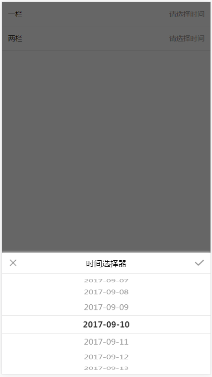
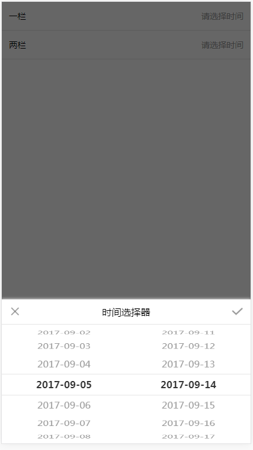

# 描述
因公司需要自己写的一个模仿ios中的select效果制作的一个滚轮插件

# 演示
[查看演示效果](https://erpang123.github.io/pricker/time.html)（请用chrome的手机模式预览）

# 使用方法
通过new pricker(nav_list, data, h);实例化一个对象，传入三个参数分别：<br/>
nav_list：滚轮所在的dom节点。（必传）<br/>
data: 数组，滚轮中显示的数据。默认为一个数字数组（可不传）<br/>
h： 间距，单个li的高度，默认是20（可不传）<br/>
可以通过给nav_list元素添加自定义属性data-value的值设置初始值。
## 案例：
* html
```html
<div class="time-dom-list">
	<p>一栏</p>
	<p class="flex-1 t-r c1" id='dom' onclick="checkTime('demo1', this)">请选择时间</p>
</div>
<div class="demo1" id='demo1'>
	<div class="title">
		<i class="t-Close" onclick="hideCheckTime()"></i>
		<label>时间选择器</label>
		<i class="t-Check" onclick="getCheckTime(this)"></i>
	</div>
	<div>
		<div class="nav-list" id='nav-list' data-value="2017-08-26">
		</div>
	</div>
</div>
```
* javascript
```javascript
var d = document.getElementById('dom');
var data = ['2017-08-23','2017-08-24','2017-08-25','2017-08-26','2017-08-27','2017-08-28','2017-08-29','2017-08-30','2017-08-31','2017-09-01','2017-09-02','2017-09-03','2017-09-04','2017-09-05','2017-09-06','2017-09-07','2017-09-08','2017-09-09','2017-09-10','2017-09-11','2017-09-12','2017-09-13','2017-09-14','2017-09-15','2017-09-16','2017-09-17','2017-09-18','2017-09-19'];
var nav_list =document.getElementById('nav-list');
new pricker(nav_list, data);
```
## 效果：
 
 
 